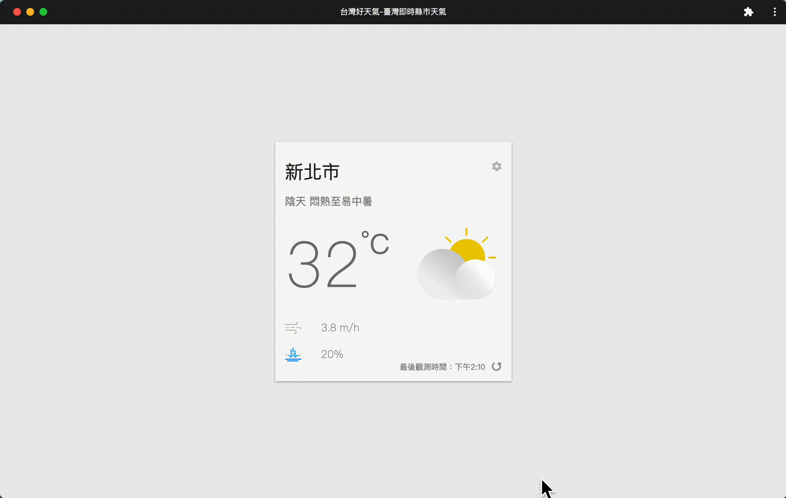

# 台灣好天氣
DEMO:[https://victor3750.github.io/realtime-weather-app/](https://victor3750.github.io/realtime-weather-app/)

## 簡介
此作品為個人練習react hook而依照教學文章[『從 Hooks 開始，讓你的網頁 React 起來』](https://ithelp.ithome.com.tw/users/20103315/ironman/2668)製作，並另行串取[日出日沒時刻-全臺各縣市年度逐日日出日沒時刻資料](https://opendata.cwb.gov.tw/dist/opendata-swagger.html#/%E5%A4%A9%E6%96%87/get_v1_rest_datastore_A_B0062_001)API來獲取每天的日出日沒時刻（作者撰寫此文章時，中央氣象局尚未提供此API，是自行整理氣象局提供的JSON資料）
## 使用API
* [局屬氣象站資料-現在天氣觀測報告](https://opendata.cwb.gov.tw/dist/opendata-swagger.html#/%E8%A7%80%E6%B8%AC/get_v1_rest_datastore_O_A0003_001)
* [一般天氣預報-今明 36 小時天氣預報](https://opendata.cwb.gov.tw/dist/opendata-swagger.html#/%E9%A0%90%E5%A0%B1/get_v1_rest_datastore_F_C0032_001)
* [日出日沒時刻-全臺各縣市年度逐日日出日沒時刻資料](https://opendata.cwb.gov.tw/dist/opendata-swagger.html#/%E5%A4%A9%E6%96%87/get_v1_rest_datastore_A_B0062_001)
## 使用套件
* **`@emotion/react`**　(css in js)
* **`@emotion/styled`**　(將emotion以styled-components的形式撰寫)
* **`gh-pages`**　(部署react網頁至github pages)
* **`normalize.css`**　(reset css)
* **`workbox`**　(for PWA)
